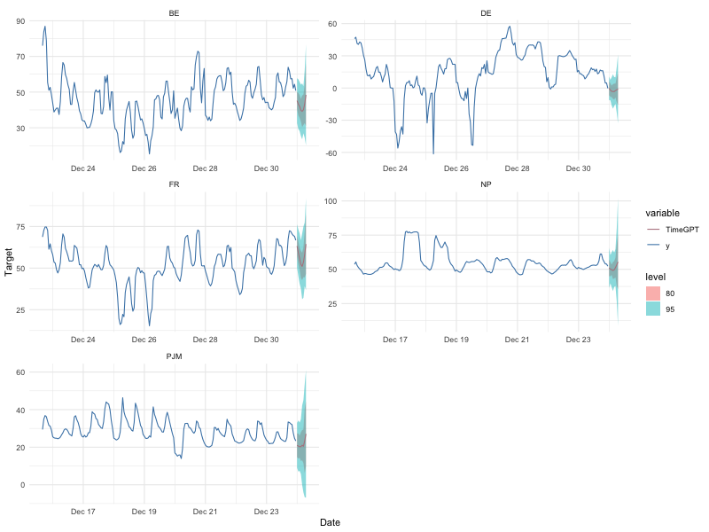

<!-- README.md is generated from README.Rmd. Please edit that file -->
<!-- logo -->

# nixtlar <a href="https://nixtla.github.io/nixtlar/"></a>

<!-- badges: start -->

[](https://CRAN.R-project.org/package=nixtlar)
[](https://github.com/Nixtla/nixtlar/actions/workflows/R-CMD-check.yaml)
[](https://cran.r-project.org/package=nixtlar)
[](https://cran.r-project.org/package=nixtlar)
[](https://www.apache.org/licenses/LICENSE-2.0)
<!-- badges: end -->

## Version 0.6.2 of nixtlar is now available! (2024-10-28)

We are happy to announce the release of `nixtlar` version 0.6.2,
introducing support for `TimeGEN-1`, `TimeGPT` optimized for Azure.

**Key updates include**:

- **Azure Integration**: You can now use `TimeGEN-1`, a version of
  `TimeGPT` optimized for the Azure infrastructure, directly through
  `nixtlar`. Simply configure your API key and Base URL to get started.
  For setup instructions, please check out our [Azure
  Quickstart](https://nixtla.github.io/nixtlar/articles/azure-quickstart.html)
  vignette.
- **Enhanced Date Support**: In response to user feedback, we’ve
  improved support for date objects created with the `as.Date` function.
  For optimal performance, `nixtlar` now requires dates in the format
  `YYYY-MM-DD` or `YYYY-MM-DD hh:mm:ss`, either as characters or
  date-objects, and this update resolves issues with the latter format.
- **Business-Day Frequency Inference**: `nixtlar` now supports inferring
  business-day frequency, which users previously had to specify
  directly.
- **Bug Fixes**: This version also includes fixes for minor bugs
  reported by our users, ensuring overall stability and performance.

Thank you for your continued support and feedback, which help us make
`nixtlar` better. We encourage you to update to the latest version to
take advantage of these improvements.

# TimeGPT-1

**The first foundation model for time series forecasting and anomaly
detection**

`TimeGPT` is a production-ready, generative pretrained transformer for
time series forecasting, developed by Nixtla. It is capable of
accurately predicting various domains such as retail, electricity,
finance, and IoT, with just a few lines of code. Additionally, it can
detect anomalies in time series data.

`TimeGPT` was initially developed in Python but is now available to R
users through the `nixtlar` package.

# Table of Contents

- [Installation](#installation)
- [Forecast Using TimeGPT in 3 Easy
  Steps](#forecast-using-timegpt-in-3-easy-steps)
- [Anomaly Detection Using TimeGPT in 3 Easy
  Steps](#anomaly-detection-using-timegpt-in-3-easy-steps)
- [Features and Capabilities](#features-and-capabilities)
- [Documentation](#documentation)
- [API Support](#api-support)
- [How to Cite](#how-to-cite)
- [License](#license)
- [Get in Touch](#get-in-touch)

# Installation

`nixtlar` is available on CRAN, so you can install the latest stable
version using `install.packages`.

``` r
# Install nixtlar from CRAN
install.packages("nixtlar")

# Then load it 
library(nixtlar)
```

Alternatively, you can install the development version of `nixtlar` from
[GitHub](https://github.com/) with `devtools::install_github`.

``` r
# install.packages("devtools")
devtools::install_github("Nixtla/nixtlar")
```

# Forecast Using TimeGPT in 3 Easy Steps

``` r
library(nixtlar)
```

1.  Set your API key. Get yours at
    [dashboard.nixtla.io](https://dashboard.nixtla.io/sign_in)

``` r
nixtla_set_api_key(api_key = "Your API key here")
```

2.  Load sample data

``` r
df <- nixtlar::electricity
head(df)
#>   unique_id                  ds     y
#> 1        BE 2016-10-22 00:00:00 70.00
#> 2        BE 2016-10-22 01:00:00 37.10
#> 3        BE 2016-10-22 02:00:00 37.10
#> 4        BE 2016-10-22 03:00:00 44.75
#> 5        BE 2016-10-22 04:00:00 37.10
#> 6        BE 2016-10-22 05:00:00 35.61
```

3.  Forecast the next 8 steps ahead

``` r
nixtla_client_fcst <- nixtla_client_forecast(df, h = 8, level = c(80,95))
#> Frequency chosen: h
head(nixtla_client_fcst)
#>   unique_id                  ds  TimeGPT TimeGPT-lo-95 TimeGPT-lo-80
#> 1        BE 2016-12-31 00:00:00 45.19045      30.49691      35.50842
#> 2        BE 2016-12-31 01:00:00 43.24445      28.96423      35.37463
#> 3        BE 2016-12-31 02:00:00 41.95839      27.06667      35.34079
#> 4        BE 2016-12-31 03:00:00 39.79649      27.96751      32.32625
#> 5        BE 2016-12-31 04:00:00 39.20454      24.66072      30.99895
#> 6        BE 2016-12-31 05:00:00 40.10878      23.05056      32.43504
#>   TimeGPT-hi-80 TimeGPT-hi-95
#> 1      54.87248      59.88399
#> 2      51.11427      57.52467
#> 3      48.57599      56.85011
#> 4      47.26672      51.62546
#> 5      47.41012      53.74836
#> 6      47.78252      57.16700
```

Optionally, plot the results

``` r
nixtla_client_plot(df, nixtla_client_fcst, max_insample_length = 200)
```



# Anomaly Detection Using TimeGPT in 3 Easy Steps

Do anomaly detection with `TimeGPT`, also in 3 easy steps! Follow steps
1 and 2 from the previous section and then use the
`nixtla_client_detect_anomalies` and the `nixtla_client_plot` functions.

``` r
nixtla_client_anomalies <- nixtlar::nixtla_client_detect_anomalies(df) 
#> Frequency chosen: h
head(nixtla_client_anomalies)
#>   unique_id                  ds     y anomaly  TimeGPT TimeGPT-lo-99
#> 1        BE 2016-10-27 00:00:00 52.58   FALSE 56.07623     -28.58337
#> 2        BE 2016-10-27 01:00:00 44.86   FALSE 52.41973     -32.23986
#> 3        BE 2016-10-27 02:00:00 42.31   FALSE 52.81474     -31.84486
#> 4        BE 2016-10-27 03:00:00 39.66   FALSE 52.59026     -32.06934
#> 5        BE 2016-10-27 04:00:00 38.98   FALSE 52.67297     -31.98662
#> 6        BE 2016-10-27 05:00:00 42.31   FALSE 54.10659     -30.55301
#>   TimeGPT-hi-99
#> 1      140.7358
#> 2      137.0793
#> 3      137.4743
#> 4      137.2499
#> 5      137.3326
#> 6      138.7662
```

``` r
nixtlar::nixtla_client_plot(df, nixtla_client_anomalies, plot_anomalies = TRUE)
```


# Features and Capabilities

`nixtlar` provides access to TimeGPT’s features and capabilities, such
as:

- **Zero-shot Inference**: TimeGPT can generate forecasts and detect
  anomalies straight out of the box, requiring no prior training data.
  This allows for immediate deployment and quick insights from any time
  series data.

- **Fine-tuning**: Enhance TimeGPT’s capabilities by fine-tuning the
  model on your specific datasets, enabling the model to adapt to the
  nuances of your unique time series data and improving performance on
  tailored tasks.

- **Add Exogenous Variables**: Incorporate additional variables that
  might influence your predictions to enhance forecast accuracy. (E.g.
  Special Dates, events or prices)

- **Multiple Series Forecasting**: Simultaneously forecast multiple time
  series data, optimizing workflows and resources.

- **Custom Loss Function**: Tailor the fine-tuning process with a custom
  loss function to meet specific performance metrics.

- **Cross Validation**: Implement out of the box cross-validation
  techniques to ensure model robustness and generalizability.

- **Prediction Intervals**: Provide intervals in your predictions to
  quantify uncertainty effectively.

- **Irregular Timestamps**: Handle data with irregular timestamps,
  accommodating non-uniform interval series without preprocessing.

# Documentation

For comprehensive documentation, please refer to our vignettes, which
cover a wide range of topics to help you effectively use `nixtlar`. The
current documentation includes guides on how to:

- [Get started and set up your API
  key](https://nixtla.github.io/nixtlar/articles/get-started.html)
- [Do anomaly
  detection](https://nixtla.github.io/nixtlar/articles/anomaly-detection.html)
- [Perform time series
  cross-validation](https://nixtla.github.io/nixtlar/articles/cross-validation.html)
- [Use exogenous
  variables](https://nixtla.github.io/nixtlar/articles/exogenous-variables.html)
- [Generate historical
  forecasts](https://nixtla.github.io/nixtlar/articles/historical-forecast.html)

The documentation is an ongoing effort, and we are working on expanding
its coverage.

# API Support

Are you a Python user? If yes, then check out the [Python
SDK](https://github.com/Nixtla/nixtla) for `TimeGPT`. You can also refer
to our [API
reference](https://docs.nixtla.io/reference/forecast_forecast_post) for
support in other programming languages.

# How to Cite

If you find TimeGPT useful for your research, please consider citing the
`TimeGPT-1` [paper](https://arxiv.org/abs/2310.03589). The associated
reference is shown below.

Garza, A., Challu, C., & Mergenthaler-Canseco, M. (2024). TimeGPT-1.
arXiv preprint arXiv:2310.03589. Available at
<https://arxiv.org/abs/2310.03589>

# License

TimeGPT is closed source. However, this SDK is open source and available
under the Apache 2.0 License, so feel free to contribute!

# Get in Touch

We welcome your input and contributions to the `nixtlar` package!

- **Report Issues**: If you encounter a bug or have a suggestion to
  improve the package, please open an
  [issue](https://github.com/Nixtla/nixtlar/issues) in GitHub.

- **Contribute**: You can contribute by opening a [pull
  request](https://github.com/Nixtla/nixtlar/pulls) in our repository.
  Whether it is fixing a bug, adding a new feature, or improving the
  documentation, we appreciate your help in making `nixtlar` better.
