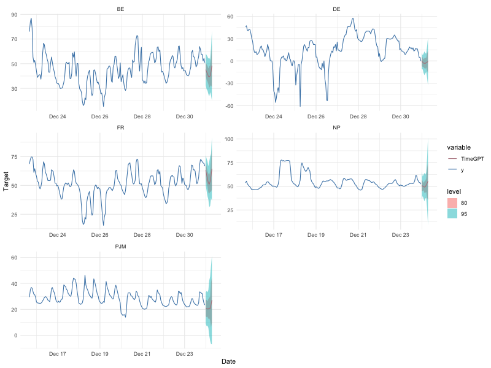
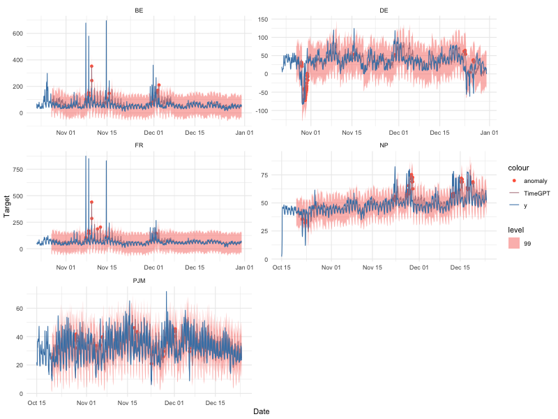

<!-- README.md is generated from README.Rmd. Please edit that file -->

<!-- logo -->

# nixtlar <a href="https://nixtla.github.io/nixtlar/"></a>

<!-- badges: start -->

[](https://CRAN.R-project.org/package=nixtlar)
[](https://github.com/Nixtla/nixtlar/actions/workflows/R-CMD-check.yaml)
[](https://cran.r-project.org/package=nixtlar)
[](https://cran.r-project.org/package=nixtlar)
[](https://www.apache.org/licenses/LICENSE-2.0)
<!-- badges: end -->

## Version 1.0.0 of nixtlar is now available on CRAN! (2026-06-22)

We are happy to announce the release of `nixtlar` version 1.0.0, our
first major release.

**Key updates include**:

- **Historic and Future Exogenous Variables**: The forecasting and
  cross-validation functions now let you distinguish between exogenous
  variables that have only historical values and those that include both
  historical and future values.
- **Updated API Endpoints**: `nixtlar` now uses the `GET` method for the
  `/model_params` and `/validate_api_key` endpoints, and forwards a
  `nixtla-model` request header so you can work with different models.
- **Lighter Dependencies**: We removed the unused `.make_request` helper
  and dropped the `future` and `future.apply` dependencies.
- **Bug Fixes**: This version resolves several date-reconstruction
  issues and a problem when using future exogenous variables with
  `h = 1`.

Note that `nixtlar` now requires R (\>= 4.1.0).

Thank you for your continued support and feedback, which help us make
`nixtlar` better. We encourage you to update to the latest version to
take advantage of these improvements.

# TimeGPT-1

**The first foundation model for time series forecasting and anomaly
detection**

`TimeGPT` is a production-ready, generative pretrained transformer for
time series forecasting, developed by Nixtla. It is capable of
accurately predicting various domains such as retail, electricity,
finance, and IoT, with just a few lines of code. Additionally, it can
detect anomalies in time series data.

`TimeGPT` was initially developed in Python but is now available to R
users through the `nixtlar` package.

# Table of Contents

- [Installation](#installation)
- [Forecast Using TimeGPT in 3 Easy
  Steps](#forecast-using-timegpt-in-3-easy-steps)
- [Anomaly Detection Using TimeGPT in 3 Easy
  Steps](#anomaly-detection-using-timegpt-in-3-easy-steps)
- [Features and Capabilities](#features-and-capabilities)
- [Documentation](#documentation)
- [API Support](#api-support)
- [How to Cite](#how-to-cite)
- [License](#license)
- [Get in Touch](#get-in-touch)

# Installation

`nixtlar` is available on CRAN, so you can install the latest stable
version using `install.packages`.

``` r
# Install nixtlar from CRAN
install.packages("nixtlar")

# Then load it 
library(nixtlar)
```

Alternatively, you can install the development version of `nixtlar` from
[GitHub](https://github.com/) with `devtools::install_github`.

``` r
# install.packages("devtools")
devtools::install_github("Nixtla/nixtlar")
```

# Forecast Using TimeGPT in 3 Easy Steps

``` r
library(nixtlar)
```

1.  Set your API key. Get yours at
    [nixtla.io/dashboard](https://www.nixtla.io/dashboard)

``` r
nixtla_set_api_key(api_key = "Your API key here")
```

2.  Load sample data

``` r
df <- nixtlar::electricity
head(df)
#>   unique_id                  ds     y
#> 1        BE 2016-10-22 00:00:00 70.00
#> 2        BE 2016-10-22 01:00:00 37.10
#> 3        BE 2016-10-22 02:00:00 37.10
#> 4        BE 2016-10-22 03:00:00 44.75
#> 5        BE 2016-10-22 04:00:00 37.10
#> 6        BE 2016-10-22 05:00:00 35.61
```

3.  Forecast the next 8 steps ahead

``` r
nixtla_client_fcst <- nixtla_client_forecast(df, h = 8, level = c(80,95))
#> Frequency chosen: h
head(nixtla_client_fcst)
#>   unique_id                  ds  TimeGPT TimeGPT-lo-95 TimeGPT-lo-80
#> 1        BE 2016-12-31 00:00:00 45.19122      30.49719      35.50965
#> 2        BE 2016-12-31 01:00:00 43.24537      28.96447      35.37618
#> 3        BE 2016-12-31 02:00:00 41.95892      27.06669      35.34091
#> 4        BE 2016-12-31 03:00:00 39.79675      27.96763      32.32674
#> 5        BE 2016-12-31 04:00:00 39.20512      24.66191      31.00021
#> 6        BE 2016-12-31 05:00:00 40.10902      23.05225      32.43594
#>   TimeGPT-hi-80 TimeGPT-hi-95
#> 1      54.87278      59.88525
#> 2      51.11456      57.52628
#> 3      48.57694      56.85116
#> 4      47.26675      51.62587
#> 5      47.41004      53.74834
#> 6      47.78209      57.16578
```

Optionally, plot the results

``` r
nixtla_client_plot(df, nixtla_client_fcst, max_insample_length = 200)
```



# Anomaly Detection Using TimeGPT in 3 Easy Steps

Do anomaly detection with `TimeGPT`, also in 3 easy steps! Follow steps
1 and 2 from the previous section and then use the
`nixtla_client_detect_anomalies` and the `nixtla_client_plot` functions.

``` r
nixtla_client_anomalies <- nixtlar::nixtla_client_detect_anomalies(df) 
#> Frequency chosen: h
head(nixtla_client_anomalies)
#>   unique_id                  ds     y anomaly  TimeGPT TimeGPT-lo-99
#> 1        BE 2016-10-27 00:00:00 52.58   FALSE 56.07206     -28.58840
#> 2        BE 2016-10-27 01:00:00 44.86   FALSE 52.41392     -32.24654
#> 3        BE 2016-10-27 02:00:00 42.31   FALSE 52.80694     -31.85352
#> 4        BE 2016-10-27 03:00:00 39.66   FALSE 52.58330     -32.07716
#> 5        BE 2016-10-27 04:00:00 38.98   FALSE 52.66963     -31.99083
#> 6        BE 2016-10-27 05:00:00 42.31   FALSE 54.10218     -30.55829
#>   TimeGPT-hi-99
#> 1      140.7325
#> 2      137.0744
#> 3      137.4674
#> 4      137.2438
#> 5      137.3301
#> 6      138.7626
```

``` r
nixtlar::nixtla_client_plot(df, nixtla_client_anomalies, plot_anomalies = TRUE)
```



# Features and Capabilities

`nixtlar` provides access to TimeGPT’s features and capabilities, such
as:

- **Zero-shot Inference**: TimeGPT can generate forecasts and detect
  anomalies straight out of the box, requiring no prior training data.
  This allows for immediate deployment and quick insights from any time
  series data.

- **Fine-tuning**: Enhance TimeGPT’s capabilities by fine-tuning the
  model on your specific datasets, enabling the model to adapt to the
  nuances of your unique time series data and improving performance on
  tailored tasks.

- **Add Exogenous Variables**: Incorporate additional variables that
  might influence your predictions to enhance forecast accuracy. (E.g.
  Special Dates, events or prices)

- **Multiple Series Forecasting**: Simultaneously forecast multiple time
  series data, optimizing workflows and resources.

- **Custom Loss Function**: Tailor the fine-tuning process with a custom
  loss function to meet specific performance metrics.

- **Cross Validation**: Implement out of the box cross-validation
  techniques to ensure model robustness and generalizability.

- **Prediction Intervals**: Provide intervals in your predictions to
  quantify uncertainty effectively.

- **Irregular Timestamps**: Handle data with irregular timestamps,
  accommodating non-uniform interval series without preprocessing.

# Documentation

For comprehensive documentation, please refer to our vignettes, which
cover a wide range of topics to help you effectively use `nixtlar`. The
current documentation includes guides on how to:

- [Get started and set up your API
  key](https://nixtla.github.io/nixtlar/articles/get-started.html)
- [Do anomaly
  detection](https://nixtla.github.io/nixtlar/articles/anomaly-detection.html)
- [Perform time series
  cross-validation](https://nixtla.github.io/nixtlar/articles/cross-validation.html)
- [Use exogenous
  variables](https://nixtla.github.io/nixtlar/articles/exogenous-variables.html)
- [Generate historical
  forecasts](https://nixtla.github.io/nixtlar/articles/historical-forecast.html)

The documentation is an ongoing effort, and we are working on expanding
its coverage.

# Python SDK

Are you a Python user? If yes, then check out the [Python
SDK](https://github.com/Nixtla/nixtla) for `TimeGPT`.

# How to Cite

If you find TimeGPT useful for your research, please consider citing the
`TimeGPT-1` [paper](https://arxiv.org/abs/2310.03589). The associated
reference is shown below.

Garza, A., Challu, C., & Mergenthaler-Canseco, M. (2024). TimeGPT-1.
arXiv preprint arXiv:2310.03589. Available at
<https://arxiv.org/abs/2310.03589>

# License

TimeGPT is closed source. However, this SDK is open source and available
under the Apache 2.0 License, so feel free to contribute!

# Get in Touch

We welcome your input and contributions to the `nixtlar` package!

- **Report Issues**: If you encounter a bug or have a suggestion to
  improve the package, please open an
  [issue](https://github.com/Nixtla/nixtlar/issues) in GitHub.

- **Contribute**: You can contribute by opening a [pull
  request](https://github.com/Nixtla/nixtlar/pulls) in our repository.
  Whether it is fixing a bug, adding a new feature, or improving the
  documentation, we appreciate your help in making `nixtlar` better.
