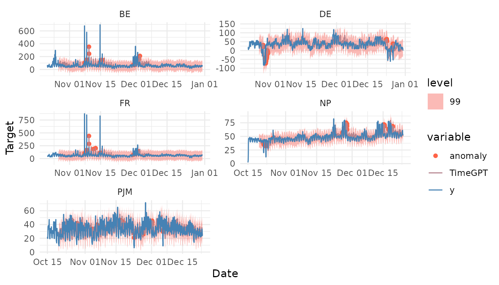

# Anomaly Detection

``` r

library(nixtlar)
```

## 1. Anomaly detection

Anomaly detection plays a crucial role in time series analysis and
forecasting. Anomalies, also known as outliers, are unusual observations
that don’t follow the expected time series patterns. They can be caused
by a variety of factors, including errors in the data collection
process, unexpected events, or sudden changes in the patterns of the
time series. Anomalies can provide critical information about a system,
like a potential problem or malfunction. After identifying them, it is
important to understand what caused them, and then decide whether to
remove, replace, or keep them.

`TimeGPT` has a method for detecting anomalies, and users can call it
from `nixtlar`. This vignette will explain how to do this. It assumes
you have already set up your API key. If you haven’t done this, please
read the [Get
Started](https://nixtla.github.io/nixtlar/articles/get-started.html)
vignette first.

## 2. Load data

For this vignette, we’ll use the electricity consumption dataset that is
included in `nixtlar`, which contains the hourly prices of five
different electricity markets.

``` r

df <- nixtlar::electricity
head(df)
#>   unique_id                  ds     y
#> 1        BE 2016-10-22 00:00:00 70.00
#> 2        BE 2016-10-22 01:00:00 37.10
#> 3        BE 2016-10-22 02:00:00 37.10
#> 4        BE 2016-10-22 03:00:00 44.75
#> 5        BE 2016-10-22 04:00:00 37.10
#> 6        BE 2016-10-22 05:00:00 35.61
```

## 3. Detect Anomalies

To detect anomalies, use
[`nixtlar::nixtla_client_detect_anomalies`](https://nixtla.github.io/nixtlar/reference/nixtla_client_detect_anomalies.md),
which requires the following parameter:

- **df**: The time series data, provided as a data frame, tibble, or
  tsibble. It must include at least two columns: one for the timestamps
  and one for the observations. The default names for these columns are
  `ds` and `y`. If your column names are different, specify them with
  `time_col` and `target_col`, respectively. If you are working with
  multiple series, you must also include a column with unique
  identifiers. The default name for this column is `unique_id`; if
  different, specify it with `id_col`.

``` r

nixtla_client_anomalies <- nixtlar::nixtla_client_detect_anomalies(df) 
#> Frequency chosen: h
head(nixtla_client_anomalies)
#>   unique_id                  ds     y anomaly  TimeGPT TimeGPT-lo-99
#> 1        BE 2016-10-27 00:00:00 52.58   FALSE 56.07206     -28.58840
#> 2        BE 2016-10-27 01:00:00 44.86   FALSE 52.41392     -32.24654
#> 3        BE 2016-10-27 02:00:00 42.31   FALSE 52.80694     -31.85352
#> 4        BE 2016-10-27 03:00:00 39.66   FALSE 52.58330     -32.07716
#> 5        BE 2016-10-27 04:00:00 38.98   FALSE 52.66963     -31.99083
#> 6        BE 2016-10-27 05:00:00 42.31   FALSE 54.10218     -30.55829
#>   TimeGPT-hi-99
#> 1      140.7325
#> 2      137.0744
#> 3      137.4674
#> 4      137.2438
#> 5      137.3301
#> 6      138.7626
```

The `anomaly_detection` method from `TimeGPT` evaluates each observation
and uses a prediction interval to determine if it is an anomaly or not.
By default,
[`nixtlar::nixtla_client_detect_anomalies`](https://nixtla.github.io/nixtlar/reference/nixtla_client_detect_anomalies.md)
uses a 99% prediction interval. Observations that fall outside this
interval will be considered anomalies and will have a value of `True` in
the `anomaly` column (`False` otherwise). To change the prediction
interval, for example to 95%, use the argument `level=c(95)`. Keep in
mind that multiple levels are not allowed, so when given several values,
[`nixtlar::nixtla_client_detect_anomalies`](https://nixtla.github.io/nixtlar/reference/nixtla_client_detect_anomalies.md)
will use the maximum.

## 4. Plot anomalies

`nixtlar` includes a function to plot the historical data and any output
from
[`nixtlar::nixtla_client_forecast`](https://nixtla.github.io/nixtlar/reference/nixtla_client_forecast.md),
[`nixtlar::nixtla_client_historic`](https://nixtla.github.io/nixtlar/reference/nixtla_client_historic.md),
[`nixtlar::nixtla_client_detect_anomalies`](https://nixtla.github.io/nixtlar/reference/nixtla_client_detect_anomalies.md)
and
[`nixtlar::nixtla_client_cross_validation`](https://nixtla.github.io/nixtlar/reference/nixtla_client_cross_validation.md).
If you have long series, you can use `max_insample_length` to only plot
the last N historical values (the forecast will always be plotted in
full).

When using
[`nixtlar::nixtla_client_plot`](https://nixtla.github.io/nixtlar/reference/nixtla_client_plot.md)
with the output of
[`nixtlar::nixtla_client_detect_anomalies`](https://nixtla.github.io/nixtlar/reference/nixtla_client_detect_anomalies.md),
set `plot_anomalies=TRUE` to plot the anomalies.

``` r

nixtlar::nixtla_client_plot(df, nixtla_client_anomalies, plot_anomalies = TRUE)
```


