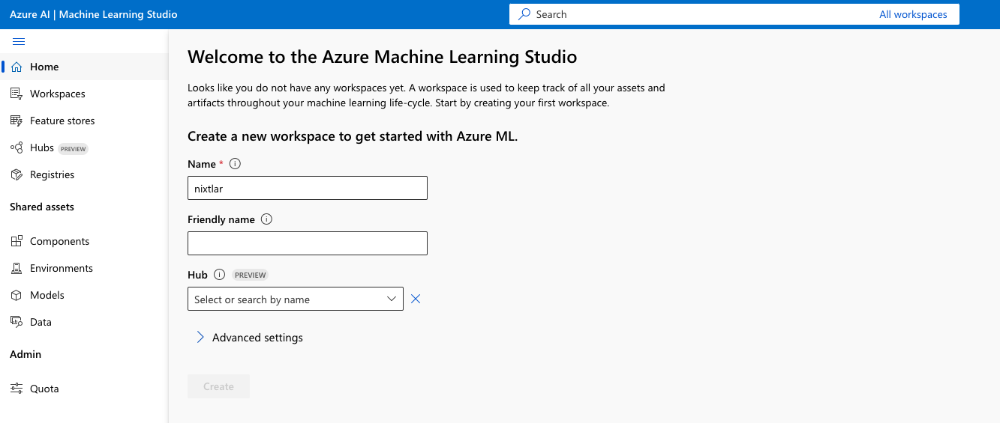
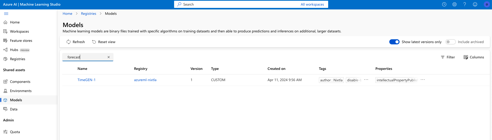
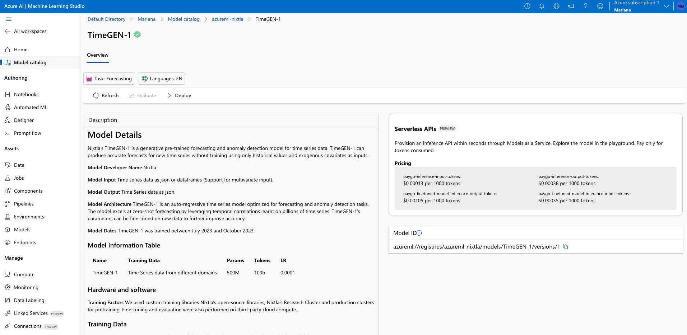
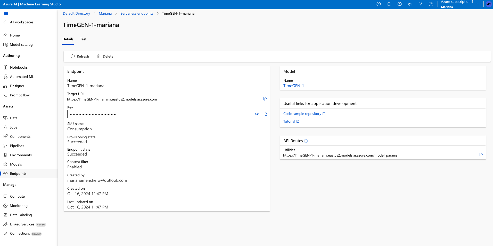
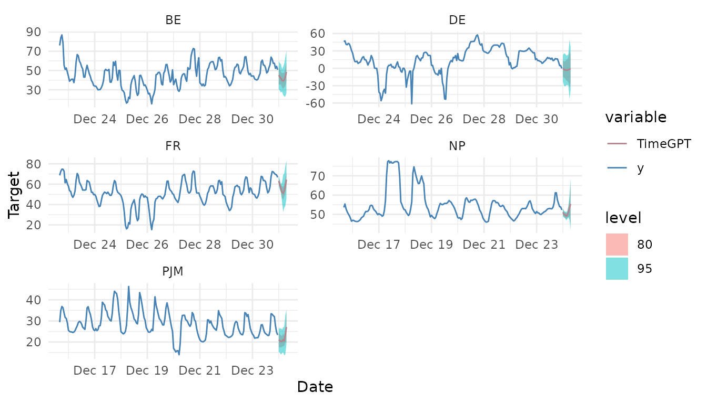

# TimeGEN-1 Quickstart (Azure)

``` r

library(nixtlar)
```

TimeGEN-1 is TimeGPT optimized for Azure, Microsoft’s cloud computing
service. You can easily access TimeGEN via `nixtlar`. To do this, just
follow these steps:

## 1. Set up a TimeGEN-1 endpoint account and generate your API key on Azure.

- Go to [ml.azure.com](https://ml.azure.com)
- Sign in or create an account.
- If you don’t have one already, create a workspace. This might require
  a subscription.



- Click on `Models` in the sidebar and select `TimeGEN` in the model
  catalog.



- Click `Deploy`. This will create an Endpoint.



- Go to your Endpoint in the sidebar. Here you will find your Base URL
  and the API key.



## 2. Install `nixtlar`

In your favorite R IDE, install `nixtlar` from CRAN or GitHub.

``` r

install.packages("nixtlar") # CRAN version 

library(devtools)
devtools::install_github("Nixtla/nixtlar")
```

## 3. Set up the Base URL and API key

To do this, use the `nixtla_client_setup` function.

``` r

nixtla_client_setup(
  base_url = "Base URL here", 
  api_key = "API key here"
)
```

## 4. Start making forecasts!

Now you can start making forecasts! We will use the electricity dataset
that is included in `nixtlar`. This dataset contains the prices of
different electricity markets.

``` r

df <- nixtlar::electricity
nixtla_client_fcst <- nixtla_client_forecast(df, h = 8, level = c(80,95))
#> Frequency chosen: h
head(nixtla_client_fcst)
#>   unique_id                  ds  TimeGPT TimeGPT-lo-95 TimeGPT-lo-80
#> 1        BE 2016-12-31 00:00:00 45.19122      30.49719      35.50965
#> 2        BE 2016-12-31 01:00:00 43.24537      28.96447      35.37618
#> 3        BE 2016-12-31 02:00:00 41.95892      27.06669      35.34091
#> 4        BE 2016-12-31 03:00:00 39.79675      27.96763      32.32674
#> 5        BE 2016-12-31 04:00:00 39.20512      24.66191      31.00021
#> 6        BE 2016-12-31 05:00:00 40.10902      23.05225      32.43594
#>   TimeGPT-hi-80 TimeGPT-hi-95
#> 1      54.87278      59.88525
#> 2      51.11456      57.52628
#> 3      48.57694      56.85116
#> 4      47.26675      51.62587
#> 5      47.41004      53.74834
#> 6      47.78209      57.16578
```

We can plot the forecasts with the `nixtla_client_plot` function.

``` r

nixtla_client_plot(df, nixtla_client_fcst, max_insample_length = 200)
```



To learn more about data requirements and TimeGPT’s capabilities, please
read the nixtlar vignettes.

## Discover the power of TimeGEN on Azure via `nixtlar`.

Deploying TimeGEN via `nixtlar` on Azure allows you to implement robust
and scalable forecasting solutions. This not only simplifies the
integration of advanced analytics into your workflows but also ensures
that you have the power of Azure’s cutting-edge technology at your
disposal through a pay-as-you-go service. To learn more, read
[here](https://www.nixtla.io/news/timegen1-on-azure).
