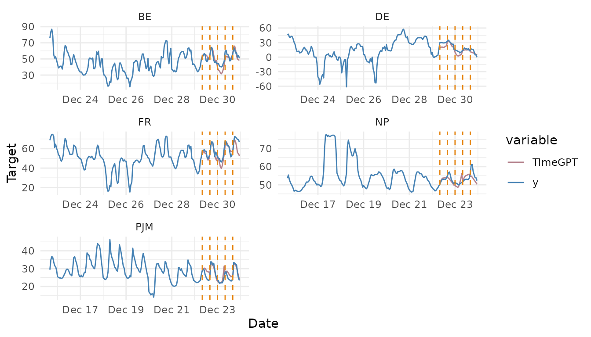

# Cross-Validation

``` r

library(nixtlar)
```

## 1. Time series cross-validation

Cross-validation is a method for evaluating the performance of a
forecasting model. Given a time series, it is carried out by defining a
sliding window across the historical data and then predicting the period
following it. The accuracy of the model is computed by averaging the
accuracy across all the cross-validation windows. This method results in
a better estimation of the model’s predictive abilities, since it
considers multiple periods instead of just one, while respecting the
sequential nature of the data.

`TimeGPT` has a method for performing time series cross-validation, and
users can call it from `nixtlar`. This vignette will explain how to do
this. It assumes you have already set up your API key. If you haven’t
done this, please read the [Get
Started](https://nixtla.github.io/nixtlar/articles/get-started.html)
vignette first.

## 2. Load data

For this vignette, we’ll use the electricity consumption dataset that is
included in `nixtlar`, which contains the hourly prices of five
different electricity markets.

``` r

df <- nixtlar::electricity
head(df)
#>   unique_id                  ds     y
#> 1        BE 2016-10-22 00:00:00 70.00
#> 2        BE 2016-10-22 01:00:00 37.10
#> 3        BE 2016-10-22 02:00:00 37.10
#> 4        BE 2016-10-22 03:00:00 44.75
#> 5        BE 2016-10-22 04:00:00 37.10
#> 6        BE 2016-10-22 05:00:00 35.61
```

## 3. Perform time series cross-validation

To perform time series cross-validation using `TimeGPT`, use
[`nixtlar::nixtla_client_cross_validation`](https://nixtla.github.io/nixtlar/reference/nixtla_client_cross_validation.md).
The key parameters of this method are:

- **df**: The time series data, provided as a data frame, tibble, or
  tsibble. It must include at least two columns: one for the timestamps
  and one for the observations. The default names for these columns are
  `ds` and `y`. If your column names are different, specify them with
  `time_col` and `target_col`, respectively. If you are working with
  multiple series, you must also include a column with unique
  identifiers. The default name for this column is `unique_id`; if
  different, specify it with `id_col`.
- **h**: The forecast horizon.
- **n_windows**: The number of windows to evaluate. Default value is 1.
- **step_size**: The gap between each cross-validation window. Default
  value is `NULL`.

``` r

nixtla_client_cv <- nixtla_client_cross_validation(df, h = 8, n_windows = 5)
#> Frequency chosen: h
head(nixtla_client_cv)
#>   unique_id                  ds              cutoff     y  TimeGPT
#> 1        BE 2016-12-29 08:00:00 2016-12-29 07:00:00 53.30 51.79749
#> 2        BE 2016-12-29 09:00:00 2016-12-29 07:00:00 53.93 55.48067
#> 3        BE 2016-12-29 10:00:00 2016-12-29 07:00:00 56.63 55.86405
#> 4        BE 2016-12-29 11:00:00 2016-12-29 07:00:00 55.66 54.45130
#> 5        BE 2016-12-29 12:00:00 2016-12-29 07:00:00 48.00 54.75994
#> 6        BE 2016-12-29 13:00:00 2016-12-29 07:00:00 46.53 53.56592
```

## 4. Plot cross-validation results

`nixtlar` includes a function to plot the historical data and any output
from
[`nixtlar::nixtla_client_forecast`](https://nixtla.github.io/nixtlar/reference/nixtla_client_forecast.md),
[`nixtlar::nixtla_client_historic`](https://nixtla.github.io/nixtlar/reference/nixtla_client_historic.md),
`nixtlar::nixtla_client_anomaly_detection` and
[`nixtlar::nixtla_client_cross_validation`](https://nixtla.github.io/nixtlar/reference/nixtla_client_cross_validation.md).
If you have long series, you can use `max_insample_length` to only plot
the last N historical values (the forecast will always be plotted in
full).

When using
[`nixtlar::nixtla_client_plot`](https://nixtla.github.io/nixtlar/reference/nixtla_client_plot.md)
with the output of
[`nixtlar::nixtla_client_cross_validation`](https://nixtla.github.io/nixtlar/reference/nixtla_client_cross_validation.md),
each cross-validation window is visually represented with vertical
dashed lines. For any given pair of these lines, the data before the
first line forms the training set. This set is then used to forecast the
data between the two lines.

``` r

nixtla_client_plot(df, nixtla_client_cv, max_insample_length = 200)
```


