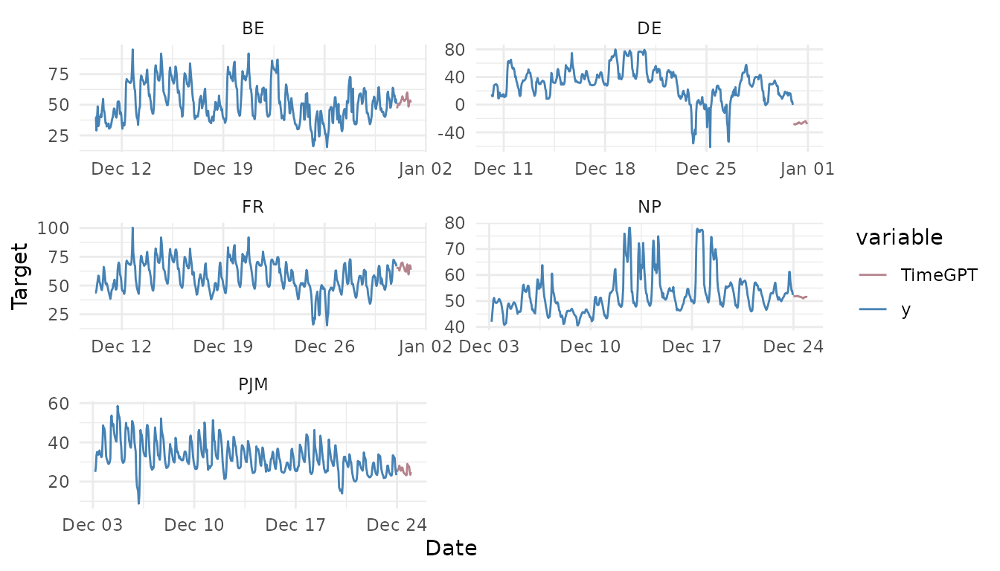

# Exogenous Variables

``` r

library(nixtlar)
```

## 1. Exogenous variables

Exogenous variables are external factors that provide additional
information about the behavior of the target variable in time series
forecasting. These variables, which are correlated with the target, can
significantly improve predictions. Examples of exogenous variables
include weather data, economic indicators, holiday markers, and
promotional sales.

`TimeGPT` allows you to include exogenous variables when generating a
forecast. This vignette will show you how to include them. It assumes
you have already set up your API key. If you haven’t done this, please
read the [Get
Started](https://nixtla.github.io/nixtlar/articles/get-started.html)
vignette first.

## 2. Load data

For this vignette, we will use the electricity consumption dataset with
exogenous variables included in `nixtlar`. This dataset contains hourly
prices from five different electricity markets, along with two exogenous
variables related to the prices and binary variables indicating the day
of the week.

``` r

df_exo_vars <- nixtlar::electricity_exo_vars
head(df_exo_vars)
#>   unique_id                  ds     y Exogenous1 Exogenous2 day_0 day_1 day_2
#> 1        BE 2016-10-22 00:00:00 70.00      49593      57253     0     0     0
#> 2        BE 2016-10-22 01:00:00 37.10      46073      51887     0     0     0
#> 3        BE 2016-10-22 02:00:00 37.10      44927      51896     0     0     0
#> 4        BE 2016-10-22 03:00:00 44.75      44483      48428     0     0     0
#> 5        BE 2016-10-22 04:00:00 37.10      44338      46721     0     0     0
#> 6        BE 2016-10-22 05:00:00 35.61      44504      46303     0     0     0
#>   day_3 day_4 day_5 day_6
#> 1     0     0     1     0
#> 2     0     0     1     0
#> 3     0     0     1     0
#> 4     0     0     1     0
#> 5     0     0     1     0
#> 6     0     0     1     0
```

There are two types of exogenous variables: **historic** and **future**.

- **Historic Exogenous Variables**: They should be included directly in
  the input dataset `df`.  
- **Future Exogenous Variables**: They must be included in the `X_df`
  parameter.

To specify which variables should be treated as historic, use the
`hist_exog_list` parameter. This parameter is available in both the
`forecast` and `cross_validation` functions.

- If `df` contains exogenous variables but they are not found in `X_df`
  nor declared in `hist_exog_list`, they will be ignored.  
- If exogenous variables were declared as historic but found in `X_df`,
  then they will be considered as historic.

In the next section, we will explore different cases for forecasting
with exogenous variables.

## 3a. Forecasting electricity prices using historic and future exogenous variables

If both historic and future values of all exogenous variables are
available, include the historic exogenous variables in `df` and the
future exogenous variables in `X_df`.

``` r

future_exo_vars <- nixtlar::electricity_future_exo_vars
head(future_exo_vars)
#>   unique_id                  ds Exogenous1 Exogenous2 day_0 day_1 day_2 day_3
#> 1        BE 2016-12-31 00:00:00      64108      70318     0     0     0     0
#> 2        BE 2016-12-31 01:00:00      62492      67898     0     0     0     0
#> 3        BE 2016-12-31 02:00:00      61571      68379     0     0     0     0
#> 4        BE 2016-12-31 03:00:00      60381      64972     0     0     0     0
#> 5        BE 2016-12-31 04:00:00      60298      62900     0     0     0     0
#> 6        BE 2016-12-31 05:00:00      60339      62364     0     0     0     0
#>   day_4 day_5 day_6
#> 1     0     1     0
#> 2     0     1     0
#> 3     0     1     0
#> 4     0     1     0
#> 5     0     1     0
#> 6     0     1     0

fcst_exo_vars <- nixtla_client_forecast(
  df_exo_vars, 
  h = 24, 
  X_df = future_exo_vars
)
#> Frequency chosen: h
#> Using future exogenous features: [Exogenous1, Exogenous2, day_0, day_1, day_2, day_3, day_4, day_5, day_6]
head(fcst_exo_vars)
#>   unique_id                  ds  TimeGPT
#> 1        BE 2016-12-31 00:00:00 74.54077
#> 2        BE 2016-12-31 01:00:00 43.34429
#> 3        BE 2016-12-31 02:00:00 44.42921
#> 4        BE 2016-12-31 03:00:00 38.09440
#> 5        BE 2016-12-31 04:00:00 37.38914
#> 6        BE 2016-12-31 05:00:00 39.08574
```

## 3b. Forecasting electricity prices using only historic exogenous variables

If future values of the exogenous variables are not available, you can
still generate forecasts using only their historical values. In this
case, simply include them in `df` and declare them in `hist_exog_list`.

``` r

fcst_exo_vars <- nixtla_client_forecast(
  df_exo_vars,
  h = 24, 
  hist_exog_list = c("Exogenous1", "Exogenous2", "day_0", "day_1", "day_2", "day_3", "day_4", "day_5", "day_6")
)
#> Frequency chosen: h
#> Using historical exogenous features: [Exogenous1, Exogenous2, day_0, day_1, day_2, day_3, day_4, day_5, day_6]
head(fcst_exo_vars)
#>   unique_id                  ds  TimeGPT
#> 1        BE 2016-12-31 00:00:00 45.76938
#> 2        BE 2016-12-31 01:00:00 47.99101
#> 3        BE 2016-12-31 02:00:00 49.49613
#> 4        BE 2016-12-31 03:00:00 49.51081
#> 5        BE 2016-12-31 04:00:00 48.51056
#> 6        BE 2016-12-31 05:00:00 50.20716
```

Note that if you don’t declare the exogenous variables in
`hist_exog_list`, they will be ignored. If we hadn’t declared them
above, the output would be the same as the TimeGPT forecast using only
the target variable `y`.

**Important:** If you include historical exogenous variables without
explicitly defining their future values, you are implicitly assuming
that their historical patterns will continue into the future. Whenever
possible, it is recommended to use future exogenous variables to make
these assumptions explicit.

## 3c. Forecasting future exogenous variables

When future exogenous variables are not available, an alternative
approach is to forecast them separately using TimeGPT. First, generate
forecasts for the exogenous variables and then pass the predicted values
in `X_df` for the main forecast.

## 3d. Forecasting electricity prices using both future and historic exogenous variables

In some cases, only a subset of future exogenous variables is available.
For example, if future values of `Exogenous1` and `Exogenous2` are
unknown, add them to `hist_exog_list`.

``` r

future_exo_vars <- future_exo_vars |> 
  dplyr::select(-dplyr::all_of(c("Exogenous1", "Exogenous2")))

fcst_exo_vars <- nixtla_client_forecast(
  df_exo_vars, 
  h = 24, 
  X_df = future_exo_vars, 
  hist_exog_list = c("Exogenous1", "Exogenous2")
)
#> Frequency chosen: h
#> The following features were declared as historic but found in X_df:: [Exogenous1, Exogenous2]. They will be considered historic.
#> Using future exogenous features: [day_0, day_1, day_2, day_3, day_4, day_5, day_6]
#> Using historical exogenous features: [Exogenous1, Exogenous2]
head(fcst_exo_vars)
#>   unique_id                  ds  TimeGPT
#> 1        BE 2016-12-31 00:00:00 47.05948
#> 2        BE 2016-12-31 01:00:00 49.28110
#> 3        BE 2016-12-31 02:00:00 50.78623
#> 4        BE 2016-12-31 03:00:00 50.80090
#> 5        BE 2016-12-31 04:00:00 49.80066
#> 6        BE 2016-12-31 05:00:00 51.49725
```

## 4. Plot TimeGPT forecast

`nixtlar` includes a function to plot the historical data and any output
from `nixtla_client_forecast`, `nixtla_client_historic`,
`nixtla_client_anomaly_detection` and `nixtla_client_cross_validation`.
If you have long series, you can use `max_insample_length` to only plot
the last N historical values (the forecast will always be plotted in
full).

``` r

nixtla_client_plot(df_exo_vars, fcst_exo_vars, max_insample_length = 500)
```


