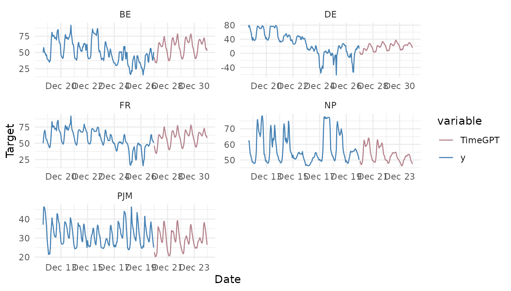

# Long-Horizon Forecasting

``` r

library(nixtlar)
```

## 1. Long-horizon forecasting

In some cases, it is necessary to forecast long horizons. Here “long
horizons” refer to predictions that exceed more than two seasonal
periods. For example, this would mean forecasting more than 48 hours
ahead for hourly data or more than 7 days for daily data. The specific
definition of “long horizon” varies depending on the data frequency.

There is a specialized `TimeGPT` model designed for long-horizon
forecasting, which is trained to predict far into the future, where the
uncertainty increases as the forecast extends further. Here we will
explain how to use the long horizon model of `TimeGPT` via `nixtlar`.

This vignette assumes you have already set up your API key. If you
haven’t done this, please read the [Get
Started](https://nixtla.github.io/nixtlar/articles/get-started.html)
vignette first.

## 2. Load data

For this vignette, we’ll use the electricity consumption dataset that is
included in `nixtlar`, which contains the hourly prices of five
different electricity markets.

``` r

df <- nixtlar::electricity
head(df)
#>   unique_id                  ds     y
#> 1        BE 2016-10-22 00:00:00 70.00
#> 2        BE 2016-10-22 01:00:00 37.10
#> 3        BE 2016-10-22 02:00:00 37.10
#> 4        BE 2016-10-22 03:00:00 44.75
#> 5        BE 2016-10-22 04:00:00 37.10
#> 6        BE 2016-10-22 05:00:00 35.61
```

For every `unique_id`, we’ll try to predict the last 96 hours. Hence, we
will first separate the data into training and test sets.

``` r

test <- df |> 
  dplyr::group_by(unique_id) |> 
  dplyr::slice_tail(n = 96) |> 
  dplyr::ungroup() 

train <- df[df$ds %in% setdiff(df$ds, test$ds), ]
```

## 3. Forecast with a long-horizon

To use the long-horizon model of `TimeGPT`, set the `model` argument to
`timegpt-1-long-horizon`.

``` r

fcst_long_horizon <- nixtlar::nixtla_client_forecast(train, h=96, model="timegpt-1-long-horizon")
#> Frequency chosen: h
head(fcst_long_horizon)
#>   unique_id                  ds  TimeGPT
#> 1        BE 2016-12-27 00:00:00 42.73280
#> 2        BE 2016-12-27 01:00:00 38.03184
#> 3        BE 2016-12-27 02:00:00 35.11706
#> 4        BE 2016-12-27 03:00:00 34.53464
#> 5        BE 2016-12-27 04:00:00 34.11326
#> 6        BE 2016-12-27 05:00:00 38.36180
```

## 4. Plot the long-horizon forecast

`nixtlar` includes a function to plot the historical data and any output
from
[`nixtlar::nixtla_client_forecast`](https://nixtla.github.io/nixtlar/reference/nixtla_client_forecast.md),
[`nixtlar::nixtla_client_historic`](https://nixtla.github.io/nixtlar/reference/nixtla_client_historic.md),
[`nixtlar::nixtla_client_detect_anomalies`](https://nixtla.github.io/nixtlar/reference/nixtla_client_detect_anomalies.md)
and
[`nixtlar::nixtla_client_cross_validation`](https://nixtla.github.io/nixtlar/reference/nixtla_client_cross_validation.md).
If you have long series, you can use `max_insample_length` to only plot
the last N historical values (the forecast will always be plotted in
full).

``` r

nixtlar::nixtla_client_plot(train, fcst_long_horizon, max_insample_length = 200)
```



## 5. Evaluate the long-horizon model

To evaluate the long-horizon forecast, we will generate the same
forecast with the default model of `TimeGPT`, which is `timegpt-1`, and
then we will compute and compare the [Mean Absolute
Error](https://en.wikipedia.org/wiki/Mean_absolute_error) (MAE) of the
two models.

``` r

fcst <- nixtlar::nixtla_client_forecast(train, h=96)
#> Frequency chosen: h
#> The specified horizon h exceeds the model horizon. This may lead to less accurate forecasts. Please consider using a smaller horizon.
head(fcst)
#>   unique_id                  ds  TimeGPT
#> 1        BE 2016-12-27 00:00:00 45.21921
#> 2        BE 2016-12-27 01:00:00 42.56666
#> 3        BE 2016-12-27 02:00:00 41.55990
#> 4        BE 2016-12-27 03:00:00 39.12502
#> 5        BE 2016-12-27 04:00:00 36.47087
#> 6        BE 2016-12-27 05:00:00 37.22281
```

We will rename the `TimeGPT` long-horizon model to merge it with the
default `TimeGPT` model. After that, we will combine them with the
actual values from the test set and compute the MAE. Note that in the
output of the `nixtla_client_forecast` function, the `ds` column
contains dates. This is because `nixtla_client_plot` uses the dates for
plotting. However, to merge the actual values, we will convert the dates
to characters.

``` r

names(fcst_long_horizon)[which(names(fcst_long_horizon) == "TimeGPT")] <- "TimeGPT-long-horizon"

res <- merge(fcst, fcst_long_horizon) # merge TimeGPT and TimeGPT-long-horizon
res$ds <- as.character(res$ds)

res <- merge(test, res) # merge with actual values
head(res)
#>   unique_id                  ds     y  TimeGPT TimeGPT-long-horizon
#> 1        BE 2016-12-27 01:00:00 38.33 42.56666             38.03184
#> 2        BE 2016-12-27 02:00:00 41.04 41.55990             35.11706
#> 3        BE 2016-12-27 03:00:00 34.62 39.12502             34.53464
#> 4        BE 2016-12-27 04:00:00 29.69 36.47087             34.11326
#> 5        BE 2016-12-27 05:00:00 28.35 37.22281             38.36180
#> 6        BE 2016-12-27 06:00:00 30.99 42.28119             47.14175
```

``` r

print(paste0("MAE TimeGPT: ", mean(abs(res$y-res$TimeGPT))))
#> [1] "MAE TimeGPT: 8.89928802286956"
print(paste0("MAE TimeGPT long-horizon: ", mean(abs(res$y-res$`TimeGPT-long-horizon`))))
#> [1] "MAE TimeGPT long-horizon: 7.09790721521739"
```

As we can see, the long-horizon version of `TimeGPT` produced a model
with a lower MAE than the default `TimeGPT` model.
