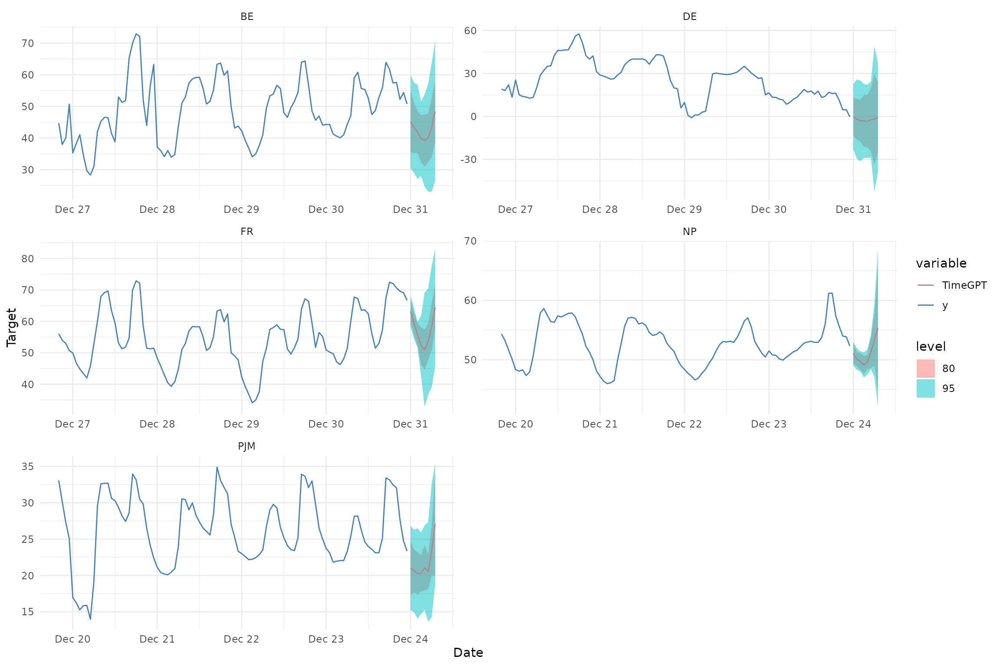
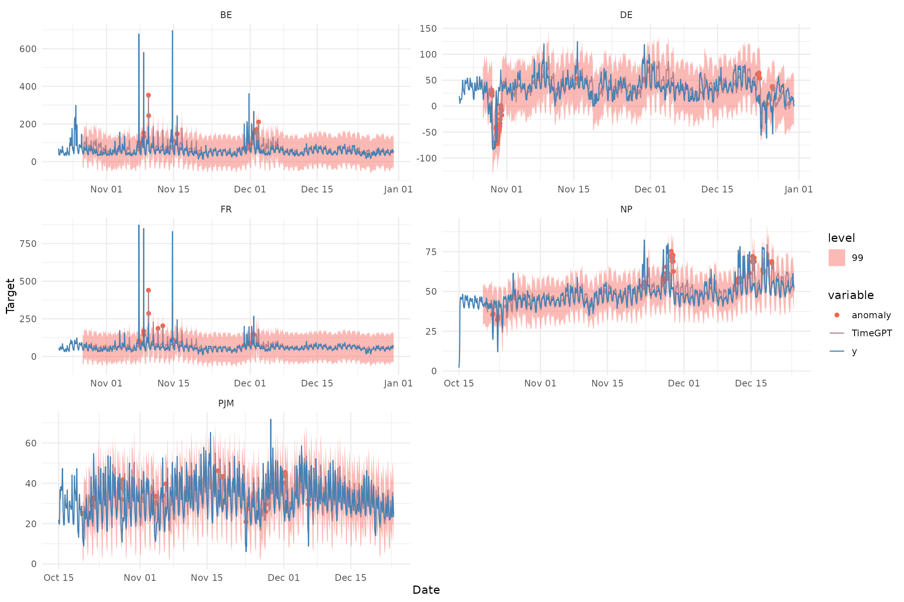

# Prediction Intervals

------------------------------------------------------------------------

``` r

library(nixtlar)
```

## 1. Uncertainty quantification via prediction intervals

For uncertainty quantification, `TimeGPT` can generate both prediction
intervals and quantiles, offering a measure of the range of potential
outcomes rather than just a single point forecast. In real-life
scenarios, forecasting often requires considering multiple alternatives,
not just one prediction. This vignette will explain how to use
prediction intervals with `TimeGPT` via the `nixtlar` package.

A prediction interval is a range of values that the forecast can take
with a given probability, often referred to as the confidence level.
Hence, a 95% prediction interval should contain a range of values that
includes the actual future value with a probability of 95%. Prediction
intervals are part of probabilistic forecasting, which, unlike point
forecasting, aims to generate the full forecast distribution instead of
just the mean or the median of that distribution.

This vignette assumes you have already set up your API key. If you
haven’t done this, please read the [Get
Started](https://nixtla.github.io/nixtlar/articles/get-started.html)
vignette first.

## 2. Load data

For this vignette, we will use the electricity consumption dataset that
is included in `nixtlar`, which contains the hourly prices of five
different electricity markets.

``` r

df <- nixtlar::electricity
head(df)
#>   unique_id                  ds     y
#> 1        BE 2016-10-22 00:00:00 70.00
#> 2        BE 2016-10-22 01:00:00 37.10
#> 3        BE 2016-10-22 02:00:00 37.10
#> 4        BE 2016-10-22 03:00:00 44.75
#> 5        BE 2016-10-22 04:00:00 37.10
#> 6        BE 2016-10-22 05:00:00 35.61
```

## 3. Forecast with prediction intervals

`TimeGPT` can generate prediction intervals when using the following
functions:

``` r

- nixtlar::nixtla_client_forecast()
- nixtlar::nixtla_client_historic() 
- nixtlar::nixtla_client_detect_anomalies()
- nixtlar::nixtla_client_cross_validation()
```

For any of these functions, simply set the `level` argument to the
desired confidence level for the prediction intervals. Keep in mind that
`level` should be a vector with numbers between 0 and 100. You can use
either `quantiles` or `level` for uncertainty quantification, but not
both.

``` r

fcst <- nixtla_client_forecast(df, h = 8, level=c(80,95))
#> Frequency chosen: h
head(fcst)
#>   unique_id                  ds  TimeGPT TimeGPT-lo-95 TimeGPT-lo-80
#> 1        BE 2016-12-31 00:00:00 45.19122      30.49719      35.50965
#> 2        BE 2016-12-31 01:00:00 43.24537      28.96447      35.37618
#> 3        BE 2016-12-31 02:00:00 41.95892      27.06669      35.34091
#> 4        BE 2016-12-31 03:00:00 39.79675      27.96763      32.32674
#> 5        BE 2016-12-31 04:00:00 39.20512      24.66191      31.00021
#> 6        BE 2016-12-31 05:00:00 40.10902      23.05225      32.43594
#>   TimeGPT-hi-80 TimeGPT-hi-95
#> 1      54.87278      59.88525
#> 2      51.11456      57.52628
#> 3      48.57694      56.85116
#> 4      47.26675      51.62587
#> 5      47.41004      53.74834
#> 6      47.78209      57.16578
```

Note that the `level` argument in the
[`nixtlar::nixtla_client_detect_anomalies()`](https://nixtla.github.io/nixtlar/reference/nixtla_client_detect_anomalies.md)
function only uses the maximum value when multiple values are provided.
Therefore, setting `level = c(90, 95, 99)`, for example, is equivalent
to setting `level = c(99)`, which is the default value.

``` r

anomalies <- nixtla_client_detect_anomalies(df) # level=c(90,95,99)
#> Frequency chosen: h
head(anomalies) # only the 99% confidence level is used 
#>   unique_id                  ds     y anomaly  TimeGPT TimeGPT-lo-99
#> 1        BE 2016-10-27 00:00:00 52.58   FALSE 56.07206     -28.58840
#> 2        BE 2016-10-27 01:00:00 44.86   FALSE 52.41392     -32.24654
#> 3        BE 2016-10-27 02:00:00 42.31   FALSE 52.80694     -31.85352
#> 4        BE 2016-10-27 03:00:00 39.66   FALSE 52.58330     -32.07716
#> 5        BE 2016-10-27 04:00:00 38.98   FALSE 52.66963     -31.99083
#> 6        BE 2016-10-27 05:00:00 42.31   FALSE 54.10218     -30.55829
#>   TimeGPT-hi-99
#> 1      140.7325
#> 2      137.0744
#> 3      137.4674
#> 4      137.2438
#> 5      137.3301
#> 6      138.7626
```

## 4. Plot prediction intervals

`nixtlar` includes a function to plot the historical data and any output
from
[`nixtlar::nixtla_client_forecast`](https://nixtla.github.io/nixtlar/reference/nixtla_client_forecast.md),
[`nixtlar::nixtla_client_historic`](https://nixtla.github.io/nixtlar/reference/nixtla_client_historic.md),
[`nixtlar::nixtla_client_detect_anomalies`](https://nixtla.github.io/nixtlar/reference/nixtla_client_detect_anomalies.md)
and
[`nixtlar::nixtla_client_cross_validation`](https://nixtla.github.io/nixtlar/reference/nixtla_client_cross_validation.md).
If you have long series, you can use `max_insample_length` to only plot
the last N historical values (the forecast will always be plotted in
full).

When available,
[`nixtlar::nixtla_client_plot`](https://nixtla.github.io/nixtlar/reference/nixtla_client_plot.md)
will automatically plot the prediction intervals.

``` r

nixtla_client_plot(df, fcst, max_insample_length = 100)
```



``` r

nixtlar::nixtla_client_plot(df, anomalies, plot_anomalies = TRUE)
```


