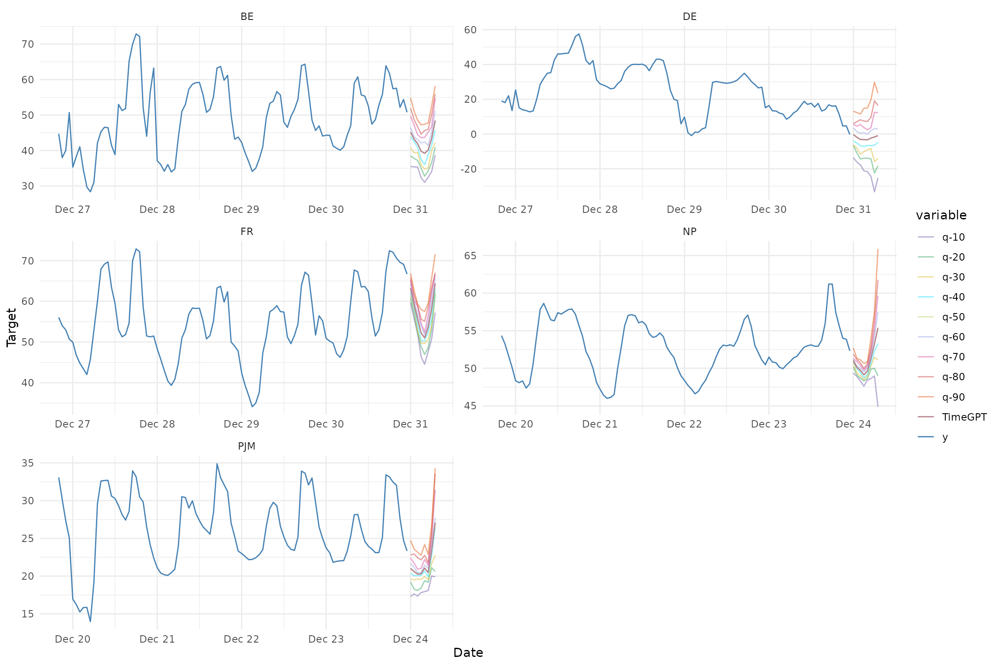

# Quantile Forecasts

------------------------------------------------------------------------

``` r

library(nixtlar)
```

## 1. Uncertainty quantification via quantiles

For uncertainty quantification, `TimeGPT` can generate both prediction
intervals and quantiles, offering a measure of the range of potential
outcomes rather than just a single point forecast. In real-life
scenarios, forecasting often requires considering multiple alternatives,
not just one prediction. This vignette will explain how to use quantiles
with `TimeGPT` via the `nixtlar` package.

Quantiles represent the cumulative proportion of the forecast
distribution. For instance, the 90th quantile is the value below which
90% of the data points are expected to fall. Notably, the 50th quantile
corresponds to the median forecast value provided by `TimeGPT`. The
quantiles are produced using [conformal
prediction](https://en.wikipedia.org/wiki/Conformal_prediction), a
framework for creating distribution-free uncertainty intervals for
predictive models.

This vignette assumes you have already set up your API key. If you
haven’t done this, please read the [Get
Started](https://nixtla.github.io/nixtlar/articles/get-started.html)
vignette first.

## 2. Load data

For this vignette, we will use the electricity consumption dataset that
is included in `nixtlar`, which contains the hourly prices of five
different electricity markets.

``` r

df <- nixtlar::electricity
head(df)
#>   unique_id                  ds     y
#> 1        BE 2016-10-22 00:00:00 70.00
#> 2        BE 2016-10-22 01:00:00 37.10
#> 3        BE 2016-10-22 02:00:00 37.10
#> 4        BE 2016-10-22 03:00:00 44.75
#> 5        BE 2016-10-22 04:00:00 37.10
#> 6        BE 2016-10-22 05:00:00 35.61
```

## 3. Forecast with quantiles

`TimeGPT` can generate quantiles when using the following functions:

``` r

- nixtlar::nixtla_client_forecast()
- nixtlar::nixtla_client_historic() 
- nixtlar::nixtla_client_cross_validation()
```

For any of these functions, simply set the `quantiles` argument to the
desired values as a vector. Keep in mind that quantiles should all be
numbers between 0 and 1. You can use either `quantiles` or `level` for
uncertainty quantification, but not both.

``` r

fcst <- nixtla_client_forecast(df, h = 8, quantiles = c(0.1, 0.2, 0.3, 0.4, 0.5, 0.6, 0.7, 0.8, 0.9))
#> Frequency chosen: h
head(fcst)
#>   unique_id                  ds  TimeGPT TimeGPT-q-10 TimeGPT-q-20 TimeGPT-q-30
#> 1        BE 2016-12-31 00:00:00 45.19067     35.50871     38.47807     40.71672
#> 2        BE 2016-12-31 01:00:00 43.24491     35.37606     37.77021     39.32019
#> 3        BE 2016-12-31 02:00:00 41.95889     35.34064     37.21904     39.44587
#> 4        BE 2016-12-31 03:00:00 39.79668     32.32713     34.98742     35.96046
#> 5        BE 2016-12-31 04:00:00 39.20456     30.99962     32.74742     34.72213
#> 6        BE 2016-12-31 05:00:00 40.10912     32.43535     34.24889     35.10847
#>   TimeGPT-q-40 TimeGPT-q-50 TimeGPT-q-60 TimeGPT-q-70 TimeGPT-q-80 TimeGPT-q-90
#> 1     43.92536     45.19067     46.45599     49.66462     51.90328     54.87264
#> 2     42.58577     43.24491     43.90405     47.16964     48.71962     51.11376
#> 3     40.85597     41.95889     43.06182     44.47191     46.69875     48.57715
#> 4     37.46490     39.79668     42.12846     43.63290     44.60593     47.26623
#> 5     36.01357     39.20456     42.39555     43.68699     45.66169     47.40950
#> 6     38.76706     40.10912     41.45117     45.10976     45.96934     47.78288
```

## 4. Plot quantiles

`nixtlar` includes a function to plot the historical data and any output
from
[`nixtlar::nixtla_client_forecast`](https://nixtla.github.io/nixtlar/reference/nixtla_client_forecast.md),
[`nixtlar::nixtla_client_historic`](https://nixtla.github.io/nixtlar/reference/nixtla_client_historic.md),
[`nixtlar::nixtla_client_detect_anomalies`](https://nixtla.github.io/nixtlar/reference/nixtla_client_detect_anomalies.md)
and
[`nixtlar::nixtla_client_cross_validation`](https://nixtla.github.io/nixtlar/reference/nixtla_client_cross_validation.md).
If you have long series, you can use `max_insample_length` to only plot
the last N historical values (the forecast will always be plotted in
full).

When available,
[`nixtlar::nixtla_client_plot`](https://nixtla.github.io/nixtlar/reference/nixtla_client_plot.md)
will automatically plot the quantiles.

``` r

nixtla_client_plot(df, fcst, max_insample_length = 100)
```


