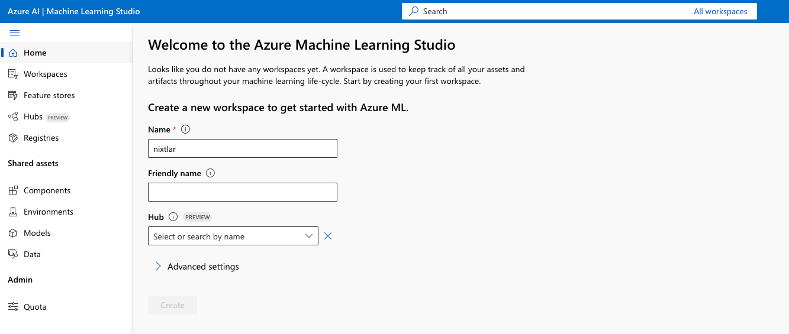
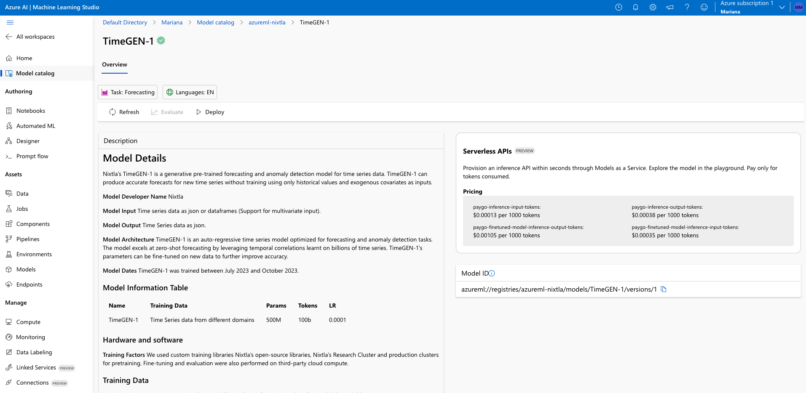
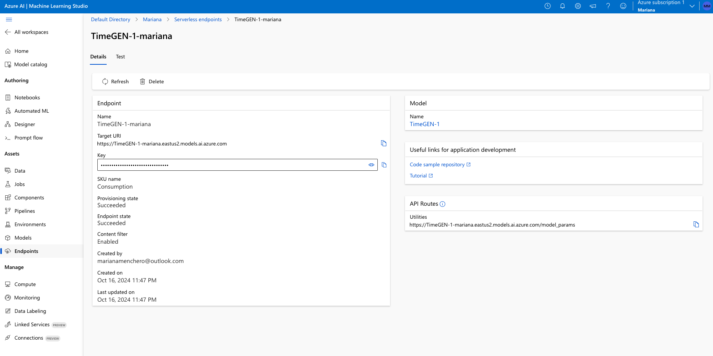

```{r setup, include=FALSE}
library(httptest2)
.mockPaths("../tests/mocks")
start_vignette(dir = "../tests/mocks")

original_options <- options("NIXTLA_API_KEY"="dummy_api_key", digits=7)

knitr::opts_chunk$set(
  collapse = TRUE,
  comment = "#>", 
  fig.width = 7, 
  fig.height = 4
)
```

```{r}
library(nixtlar)
```

TimeGEN-1 is TimeGPT optimized for Azure, Microsoft's cloud computing service. You can easily access TimeGEN via `nixtlar`. To do this, just follow these steps: 

## 1. Set up a TimeGEN-1 endpoint account and generate your API key on Azure. 

- Go to [ml.azure.com](https://ml.azure.com)
- Sign in or create an account.
- If you don't have one already, create a workspace. This might require a subscription.

 

- Click on `Models` in the sidebar and select `TimeGEN` in the model catalog.  

 

- Click `Deploy`. This will create an Endpoint. 

 

- Go to your Endpoint in the sidebar. Here you will find your Base URL and the API key. 

 

## 2. Install `nixtlar`

In your favorite R IDE, install `nixtlar` from CRAN or GitHub. 

```{r, eval = FALSE}
install.packages("nixtlar") # CRAN version 

library(devtools)
devtools::install_github("Nixtla/nixtlar")
```

## 3. Set up the Base URL and API key 

To do this, use the `nixtla_client_setup` function. 

```{r, eval = FALSE}
nixtla_client_setup(
  base_url = "Base URL here", 
  api_key = "API key here"
)
```

## 4. Start making forecasts! 

Now you can start making forecasts! We will use the electricity dataset that is included in `nixtlar`. This dataset contains the prices of different electricity markets. 

```{r}
df <- nixtlar::electricity
nixtla_client_fcst <- nixtla_client_forecast(df, h = 8, level = c(80,95))
head(nixtla_client_fcst)
```

We can plot the forecasts with the `nixtla_client_plot` function. 

```{r}
nixtla_client_plot(df, nixtla_client_fcst, max_insample_length = 200)
```

To learn more about data requirements and TimeGPT's capabilities, please read the nixtlar vignettes.

## Discover the power of TimeGEN on Azure via `nixtlar`. 

Deploying TimeGEN via `nixtlar` on Azure allows you to implement robust and scalable forecasting solutions. This not only simplifies the integration of advanced analytics into your workflows but also ensures that you have the power of Azure’s cutting-edge technology at your disposal through a pay-as-you-go service. To learn more, read [here](https://www.nixtla.io/news/timegen1-on-azure).

```{r, include=FALSE}
options(original_options)
end_vignette()
```
