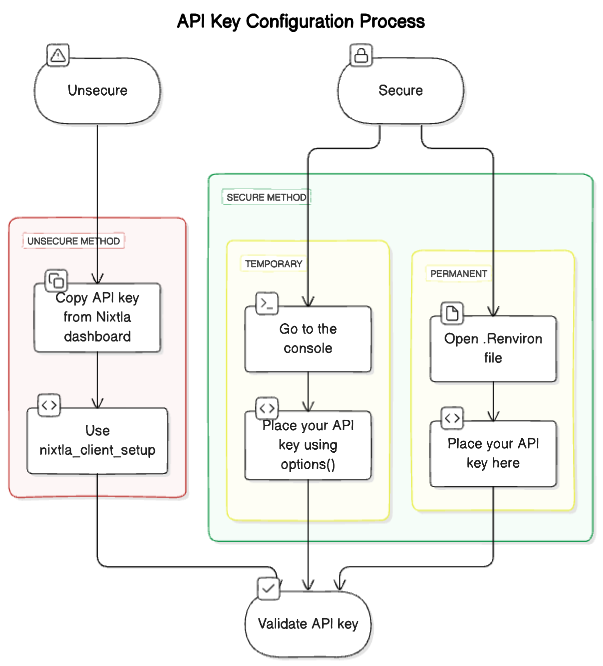

```{r setup, include=FALSE}
library(httptest2)
.mockPaths("../tests/mocks")
start_vignette(dir = "../tests/mocks")

original_options <- options("NIXTLA_API_KEY"="dummy_api_key", digits=7)

knitr::opts_chunk$set(
  collapse = TRUE,
  comment = "#>", 
  fig.width = 7, 
  fig.height = 4
)
```

```{r}
library(nixtlar)
```

This vignette explains what an API key is, how to get yours and how to set it up to use `nixtlar`. 

## 1. What is an API key? 
An API key is a unique string of characters that is used to authenticate your requests when using `nixtlar`. It is necessary to have a valid API key to use any of the core functions from `nixtlar` that interact with `TimeGPT`: 

```{r, eval=FALSE}
# core functions that interact with TimeGPT
- nixtlar::nixtla_client_forecast()
- nixtlar::nixtla_client_historic()
- nixtlar::nixtla_client_detect_anomalies()
- nixtlar::nixtla_client_cross_validation()
```

## 2. How can I get one? 
To obtain you API key, please sign up here: https://dashboard.nixtla.io/sign_in

After registering, you will have access to your developer dashboard. Under `API keys`, you will find your personal API key. Please note that your API key should not be shared with others, and it is your responsibility to keep it safe. 

## 3. How do I set up my API key? 

There are several methods to set up your API key. 

### 3.1 Using the `nixtlar::nixtla_client_setup` function

`nixtlar` provides a function to directly set up your API key: 

```{r, eval=FALSE}
nixtlar::nixtla_client_setup(api_key = "Your API key here")
```

Keep in mind that if you close your R session or restart it, then you will need to set up your API key again. 

In earlier versions of `nixtlar`, the function to set up your API key was called `nixtla_set_api_key`. However, `nixtla_client_setup` now provides the same functionality, along with the ability to set Azure endpoints. The `nixtla_set_api_key` function is still available, but it now simply calls `nixtla_client_setup`.

In addition to the `api_key` parameter, `nixtla_client_setup` has a `base_url` parameter. It's default value is `NULL`, and in this case, it uses the `TimeGPT` URL. You can leave is as `NULL` unless you are working with Azure. See Section 5 below for more information. 

### 3.2 Using an environment variable 

#### a. Using `options`

You can set up your API key using `options`. 

```{r, eval=FALSE}
options(NIXTLA_API_KEY="Your API key here")
```

This will make your API key globally available throughout your R session. Although it will not appear in the list of variables, it will persist until you close or restart the session or until you explicitly change it.

To verify that it was set up correctly, use:

```{r, eval=FALSE}
getOption("NIXTLA_API_KEY")
```

#### b. Using `.Renviron` 

For a more persistent method that can be used across different projects, set up your API key as environment variable. To do this, you first need to load the `usethis` package.

```{r, eval=FALSE}
library(usethis)
usethis::edit_r_environ()
```

This will open your `.Reviron` file. Place your API key here, named `NIXTLA_API_KEY`.

```{r, eval=FALSE}
# Inside the .Renviron file 
NIXTLA_API_KEY="paste your API key here"
```

You will need to restart R for the changes to take effect. Note that modifying the `.Renviron` file affects **all** your R sessions, so if you are not comfortable with this, set your API key using the `nixtlar::nixtla_client_setup` function.

 

## 4. Validate your API key (optional)

`nixtlar` includes a function to validate your API key.

```{r, eval=FALSE}
nixtlar::nixtla_validate_api_key()
```

The `nixtla_validate_api_key` function will return `TRUE` if your key is valid, and `FALSE` otherwise. 

You do not need to validate your API key every time you set it up, only when you are unsure of its status. Alternatively, in your dashboard, under `API keys`, there is a label next to your API key indicating its status, for example, `active`. 

## 5. Azure endpoints 

When working on Azure, you will need to specify both a Base URL and your API key, as shown below.

```{r, eval=FALSE}
nixtlar::nixtla_client_setup(
  base_url = "Base URL here", 
  api_key = "Your API key here"
)
```

You can also use one of the more secure and permanent method described above, by specifying the `NIXTLA_BASE_URL` in addition to the `NIXTLA_API_KEY`. 

To learn more, please refer to the [TimeGEN-1 Quickstart (Azure)](https://nixtla.github.io/nixtlar/articles/azure-quickstart.html) vignette. 

```{r, include=FALSE}
options(original_options)
end_vignette()
```

